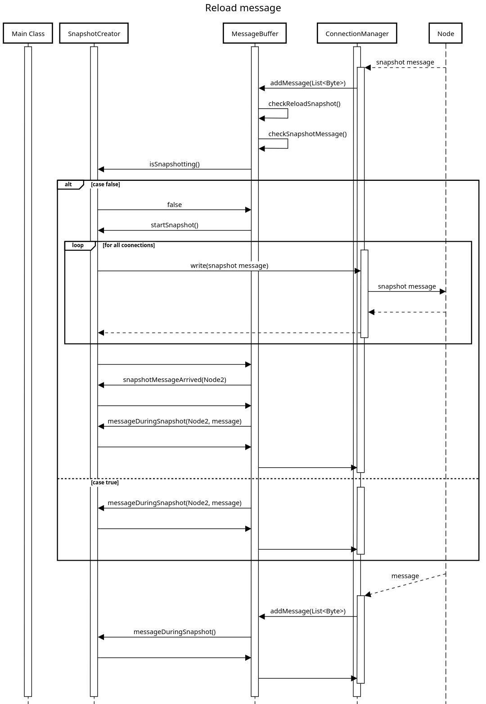

# Java library for distributed snapshot
Implementation in Java of a library that offers the capability of storing a distributed snapshot on disk.

The project also provides an application that uses the library to cope with node failures (restarting from the last valid snapshot).

The library is state and message agnostic.

Assumptions:
  * Nodes do not crash in the middle of the snapshot.
  * The topology of the network (including the set of nodes) does not change during a snapshot.

